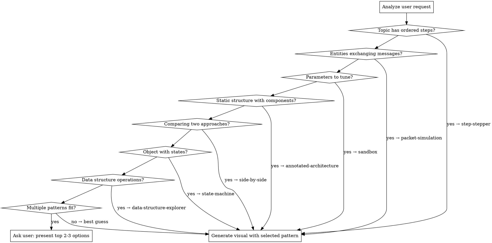

# Interactive Visual

Generate interactive, browser-based educational visuals for technical concepts. Picks the best design pattern for the topic, generates a self-contained React app, serves it locally with hot reload, and offers a save option.

## Pattern Library

Select the best pattern based on topic classification:

```
PATTERN                    BEST FOR                               SIGNAL WORDS
─────────────────────────────────────────────────────────────────────────────────
step-stepper               Sequential processes, protocols         "lifecycle", "flow", "handshake", "steps"
packet-simulation          Network protocols, message exchanges     "messages", "packets", "request/response", "session"
sandbox                    Tunable systems, parameter exploration   "what if", "how does X affect Y", "tuning"
annotated-architecture     System design, component relationships   "architecture", "components", "system design"
side-by-side               Trade-off comparisons, A vs B            "compare", "vs", "difference", "trade-off"
state-machine              Object lifecycles, FSMs, connection      "states", "transitions", "lifecycle"
sequence-diagram           Method calls, service interactions       "calls", "API flow", "interaction"
class-component            OOP design, module dependencies          "classes", "inheritance", "interfaces", "modules"
timeline                   Concurrent processes, race conditions    "concurrent", "parallel", "scheduling", "race"
data-structure-explorer    Trees, graphs, hash tables, order books  "insert", "delete", "traverse", "operations"
flowchart                  Decision logic, debugging, routing       "decision", "if/else", "routing", "branching"
─────────────────────────────────────────────────────────────────────────────────
```

## Pattern Selection Flow



## Implementation

### Step 1: Classify and Confirm

Analyze the user's request. State which pattern you'll use and why. If ambiguous, present 2-3 options with one-line descriptions and let the user pick.

Example: "This is a protocol flow between two entities, so I'll use **packet-simulation**. Would you prefer a different format?"

### Step 2: Set Up Dev Server

Create a project directory and start a dev server with hot reload:

```bash
# Create working directory
mkdir -p /tmp/interactive-visual && cd /tmp/interactive-visual

# Generate the HTML file
# (file is written here by the agent)

# Start dev server with hot reload
npx -y live-server --port=3456 --no-browser --quiet &

# Open in browser
xdg-open http://localhost:3456/visual.html 2>/dev/null || open http://localhost:3456/visual.html
```

If `npx` is unavailable, fall back to:
```bash
python3 -m http.server 3456 --directory /tmp/interactive-visual &
```

### Step 3: Generate the Visual

Write the HTML file to `/tmp/interactive-visual/visual.html`. All visuals MUST follow these rules:

**Tech stack:**
- React 18 via CDN (`unpkg.com/react@18`)
- Babel standalone for JSX
- All code in a single self-contained HTML file
- SVG for diagrams (not canvas — SVG is inspectable and accessible)
- CSS transitions/animations for interactivity (not JS animation libraries)

**Design system — MANDATORY:**
```css
/* Theme: Light, clean, modern */
--bg-primary: #ffffff;
--bg-secondary: #f8f9fa;
--bg-tertiary: #e9ecef;
--text-primary: #1a1a2e;
--text-secondary: #495057;
--text-muted: #868e96;
--border: #dee2e6;
--border-light: #e9ecef;

/* Accent colors — use semantically */
--blue: #4263eb;       /* Primary actions, client-side, information */
--green: #2b8a3e;      /* Success, server-side, positive state */
--amber: #e67700;      /* Warning, important notes, caution */
--red: #c92a2a;        /* Error, failure, critical */
--purple: #7048e8;     /* Infrastructure, monitoring, metadata */
--cyan: #1098ad;       /* Data flow, secondary information */

/* Typography */
font-family: -apple-system, BlinkMacSystemFont, 'Segoe UI', Roboto, sans-serif;
font-family-mono: 'SF Mono', 'Fira Code', 'Consolas', monospace; /* for code/data */

/* Spacing: 4px grid */
/* Border radius: 8px for cards, 4px for buttons/badges */
/* Shadows: subtle, max 0 2px 8px rgba(0,0,0,0.08) */
```

**Interaction requirements:**
- Keyboard navigation (arrow keys, space, escape)
- Hover states on all interactive elements (cursor: pointer, subtle highlight)
- Click feedback (brief scale or color transition)
- Progress indicators where applicable (step X of Y, progress bar)
- Responsive layout (min-width: 900px is acceptable for technical diagrams)

**Educational requirements:**
- Every visual MUST have a prose explanation panel that updates with the current state
- Explanations should say WHY, not just WHAT
- Include domain-relevant context (trading, systems, networking as appropriate)
- Provide a "detail panel" for clicking into deeper information on any element

**UML-inspired conventions (simplified):**
- Boxes for components/classes (rounded corners, no heavy UML notation)
- Solid arrows for direct calls/data flow, dashed for async/optional
- Color-code by subsystem or role, not by UML stereotype
- Include cardinality/multiplicity only when it aids understanding
- Swim lanes for sequence/timeline diagrams
- State circles/rounded-rects for state machines
- Skip formal UML stereotypes (<<interface>>, <<abstract>>) — use visual cues instead (italic text, dashed borders)

### Step 4: Iterate

After generating:
1. Open the browser automatically
2. Tell the user what was generated and how to interact with it
3. Ask for feedback
4. Edit the file in place — live-server auto-reloads

### Step 5: Save

When the user says "save", "keep this", or "I like this":

```bash
# Ask where to save (suggest a default based on context)
# Copy from temp to permanent location
cp /tmp/interactive-visual/visual.html <target-path>
```

Default save locations:
- If in a project with existing visuals: `./visuals/<topic-name>.html`
- If in study materials: `./<current-dir>/visuals/<topic-name>.html`
- Otherwise: ask the user

## Pattern-Specific Guidance

### step-stepper
- Minimum content per step: diagram mutation + 2-3 sentence explanation
- Always include: step counter, progress bar, prev/next buttons, keyboard nav
- Animate the NEW element appearing at each step (fade in, slide in)
- Gray out future elements, full-color past and current

### packet-simulation
- Entities as vertical swim lanes
- Packets animate between lanes (use CSS @keyframes translateX)
- Transport controls: play/pause/step/speed/reset
- Click any packet to see payload detail
- Include a scrubber/timeline bar
- Show sequence numbers on each message

### sandbox
- Left sidebar: parameter sliders with labels and current values
- Center: reactive SVG chart or diagram
- Bottom: real-time explanation of current state
- Include presets (named parameter combinations)
- Debounce slider changes, re-run simulation from scratch on change

### annotated-architecture
- Components as color-coded boxes grouped by subsystem
- Data flow arrows between components (animated dots optional)
- Hover: one-line tooltip. Click: expand detail panel (description, concerns, latency budget)
- "Trace" buttons: highlight a specific flow path step-by-step
- Search/filter components

### side-by-side
- Two columns with synchronized step advancement
- Shared step controls between both panels
- Center column: comparison summary for current step
- Bottom: progressive comparison table (rows appear as you advance)
- Highlight "winner" for each comparison dimension
- Make the KEY DIFFERENCE visually dramatic (the teaching moment)

### state-machine
- States as rounded rectangles, transitions as arrows
- Active state highlighted, transition arrows light up on step
- Click any state for description
- Scenario walkthroughs that animate through state sequences
- Show the triggering event on each transition

### sequence-diagram
- Vertical lifelines with activation bars
- Messages as horizontal arrows (sync = solid, async = dashed)
- Self-calls as loopback arrows
- Group boxes for loops/alt/opt fragments
- Click any message to see detail

### data-structure-explorer
- Visual representation of the data structure (tree nodes, array cells, hash buckets)
- Operation panel: buttons for insert/delete/search with input fields
- Step-by-step animation of each operation
- Highlight affected nodes/cells during operation
- Show complexity analysis for each operation

### timeline
- Horizontal time axis, parallel swim lanes per actor/thread
- Events as blocks or points on each lane
- Show causality arrows between related events across lanes
- Highlight race conditions or conflicts
- Scrubber to move through time

### flowchart
- Decision diamonds, process rectangles, start/end ovals
- Highlight the current path based on user input
- Interactive: user clicks decisions to explore different paths
- Show the outcome at each terminal node

### class-component
- Boxes with name, key attributes, key methods (not exhaustive)
- Solid lines for composition, dashed for dependency
- Color by module/package
- Click to expand full detail
- Show relationships with labeled arrows

## Anti-Patterns

- No dark themes (light theme only — readability first)
- No static images (everything must be interactive)
- No canvas (use SVG — inspectable, accessible, scalable)
- No external dependencies beyond React/Babel CDN
- No build steps (self-contained HTML)
- No excessive animation (subtle transitions, not flashy)
- No walls of text in the visual (prose lives in the explanation panel, not on the diagram)
- No formal UML notation (simplified, clean, readable)

## Quick Reference

| User says... | Pattern | Why |
|---|---|---|
| "Show me how TCP handshake works" | step-stepper | Sequential process |
| "Visualize FIX message flow" | packet-simulation | Entity message exchange |
| "What happens when I change cwnd?" | sandbox | Parameter exploration |
| "Draw the trading system architecture" | annotated-architecture | Component structure |
| "Compare TCP vs UDP" | side-by-side | Two-way comparison |
| "Show TCP connection states" | state-machine | States + transitions |
| "How do microservices call each other?" | sequence-diagram | Service interactions |
| "Show the class hierarchy" | class-component | OOP structure |
| "Visualize the race condition" | timeline | Concurrent events |
| "Show how a B-tree insert works" | data-structure-explorer | Data structure ops |
| "Show the routing decision logic" | flowchart | Branching decisions |
