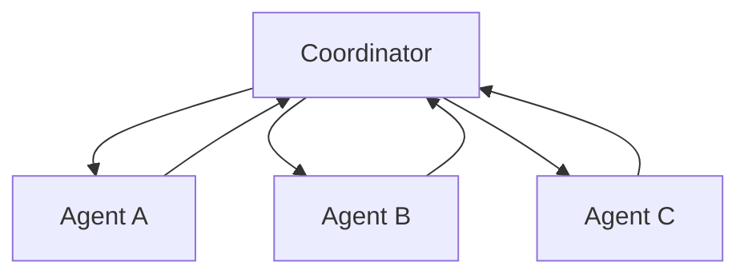

# Architect Phase 1 — Closing the Gaps

D1, D2, D4: where does the intelligence live?

> **The theme:** the exam favours designs where the **model** receives structured information and reasons about it, over designs where tools/infrastructure hide the logic. Give the model actionable data.

---

## Multi-Agent Handoff — Self-Attribution

**The trap:** coordinator tries to track who said what.

**The rule:** subagents are stateless and isolated. The coordinator cannot inspect their internals. Findings must be self-contained.

**The pattern:**

```json
{
  "source": "agent_role",
  "finding": "...",
  "evidence": "...",
  "confidence": "high | medium | low"
}
```

**Coordinator's job:** aggregate, deduplicate, resolve conflicts — **not** maintain a lookup table of which agent said what.

---

## Multi-Agent Handoff — Sizing the Handoff

**"Fits in context" ≠ "best use of context."** Raw subagent output is verbose and dilutes signal.

**Default:** structured summaries with key findings + source references.

**Pass raw detail only when** the downstream agent needs to *reason over details* — e.g., compliance review on full contract text.

**Decision question:** does the downstream agent *synthesise findings* (pass summary) or *reason over details* (pass raw)?

---

## Hub-and-Spoke — Why It Wins Under Ambiguity



- **Mesh tempts** when agents have cross-dependencies (A needs B, B needs C)
- **Hub-and-spoke still wins:** coordinator controls data flow, can transform/filter between agents, single point of debugging
- **Pipeline** = special case where dependencies are strictly sequential

---

## Tool Design — Scoping vs `tool_choice`

Two different questions:

| Question | Mechanism |
|---|---|
| Which tools CAN the agent see? | **Scoping** (access control) |
| Which tool should it call RIGHT NOW? | `tool_choice` (per-request) |

- **Scoping** = least privilege. Configure which tools/MCP servers the agent has access to.
- **`tool_choice`** = per-call: `auto`, `any`, `{type: "tool", name: "X"}`.
- **Anti-pattern:** using `tool_choice` as access control. It can't hide tools, only pick which is *called*.

---

## Tool Design — Structured Error Responses

**The trap:** `"error": "request failed"` → model retries blindly → infinite loop.

**The rule:** surface errors the model needs to **decide** about. Auto-resolving transient failures stay inside the tool.

**The schema:**

```json
{
  "error_type": "rate_limit | invalid_input | upstream_down",
  "is_retriable": true,
  "retry_after": 30,
  "message": "Human-readable explanation"
}
```

**Principle:** the model is the decision-maker. Give it enough to retry, switch approach, or escalate.

---

## Structured Output — `detected_pattern`

**The problem:** classifier outputs a label but you can't debug *why*. False positives are opaque.

**The fix:** force the model to articulate the evidence.

```json
{
  "classification": "policy_violation",
  "detected_pattern": "phrase 'terms of service' in marketing context",
  "confidence": "medium"
}
```

- **Confidence tells you *how sure*** — useless for root cause.
- **`detected_pattern` tells you *why*** — you can tell a real policy violation from a false positive caused by an unrelated phrase.
- Near-zero cost (model fills it naturally), enormous debug value.

---

## Validation Loops — Retriable vs Non-Retriable

| Error | Retriable? | Why |
|---|---|---|
| Wrong date format | Yes | Model self-corrects with error appended to prompt |
| Misread field | Yes | Same — retriable parse error |
| Field doesn't exist in source | **No** | No retry creates data that isn't there |

**The triage step** before retrying: check the source document. Only retry if the error is a model mistake, not a data gap.

`detected_pattern` helps here too: if the model says "extracted date from paragraph 3" and paragraph 3 has no date — that's a hallucination, not a parse error.

---

## Exam-Morning Checklist

Internalise these five:

1. **Self-attribution** — subagents return `{source, finding, evidence, confidence}`; coordinator aggregates, doesn't track
2. **Handoff sizing** — summaries by default; raw only when downstream reasons over details
3. **Scoping ≠ `tool_choice`** — scoping is access control, `tool_choice` is per-call selection
4. **Structured errors** — `{error_type, is_retriable, retry_after, message}`; transient failures stay in the tool
5. **Diagnostic schemas** — `detected_pattern` > confidence score; triage source before retrying

**Where does the intelligence live? With the model, given structured information.**
